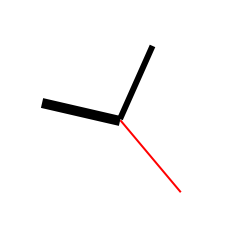

# Canvas Analog Clock

显示模拟时钟的 canvas 网页小应用。

浏览器可设置参数：

| 参数         | 说明         | 默认值       | 可能的值                                    |
|------------|------------|-----------|-----------------------------------------|
| theme      | 主题         | `white`   | `white` 白色 `black` 黑色                   |
| type       | 指针类型       | `rounded` | `rect` 方块 `pointer` 尖形指针 `rounded` 圆形指针 |
| number     | 刻度标识       | `ALB`     | `ALB` 阿拉伯数字 `LM` 罗马数字  (大小写均可)          |
| skiphour   | 跳过小时数显示分钟数 | `0`       | `0` 不作处理 `1` 跳过                         |
| zoomsecond | 放大显示秒数     | `0`       | `0` 否 `1` 是                             |
| showinfo   | 显示参数值      | `1`       | `0` 否 `1` 是                             |
| showdate   | 显示日期、星期    | `1`       | `0` 否 `1` 是                             |

例子：
- 白色 [http://kylebing.cn/tools/clock-a?theme=white](http://kylebing.cn/tools/clock-a?theme=white)
- 黑色 [http://kylebing.cn/tools/clock-a?theme=black](http://kylebing.cn/tools/clock-a?theme=black)
- 白色指针尖 [http://kylebing.cn/tools/clock-a?theme=white&type=pointer](http://kylebing.cn/tools/clock-a?theme=white&type=pointer)
- 白色指针尖罗马数字 [http://kylebing.cn/tools/clock-a?theme=white&type=pointer&number=lm](http://kylebing.cn/tools/clock-a?theme=white&type=pointer&number=lm)
- 白色放大实时秒数 [http://kylebing.cn/tools/clock-a?zoomsecond=1](http://kylebing.cn/tools/clock-a?zoomsecond=1)

> CSDN 教程: [https://blog.csdn.net/KimBing/article/details/141223741](https://blog.csdn.net/KimBing/article/details/141223741)

# GIF

